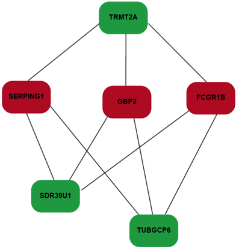

[South African Tuberculosis Vaccine Initiative](http://satvi.uct.ac.za/)

# RISK6  

#### About

A simple R-script for computing risk6 score from RT-qPCR data. Included is a typical RT-qPCR data set (testData.RData) with sample replicates (columns) and risk6 signature genes (rows)

#### How to
- load ("testData.RData")
- source ("risk6.R")
- risk6 (testData)

#### How it works
- Measure the Ct for the six primer-probe  by RT-qPCR.
- For each of the nine transcript pairs, compute the difference in raw Ct
- Compare the measured ratio to ratios in the look-up table for the given pair of transcripts in "RISK6Gene_ScoreTable. Find the minimal ratio in column 1 of the table that is greater than or equal to the measured ratio. 
- Assign the corresponding score in the second column of the look-up table to the ratio. If the measured ratio is larger than all ratios in column 1 of the look-up table, then assign a score of 1 to the ratio.
- Compute the average over the scores generated from the set of pairs. If any assays failed on the sample, compute the average score over all ratios not including the failed assays. The resulting average is the final score for that sample.  

  
#### structure of risk6

Email: Stanley.Kimbung@uct.ac.za